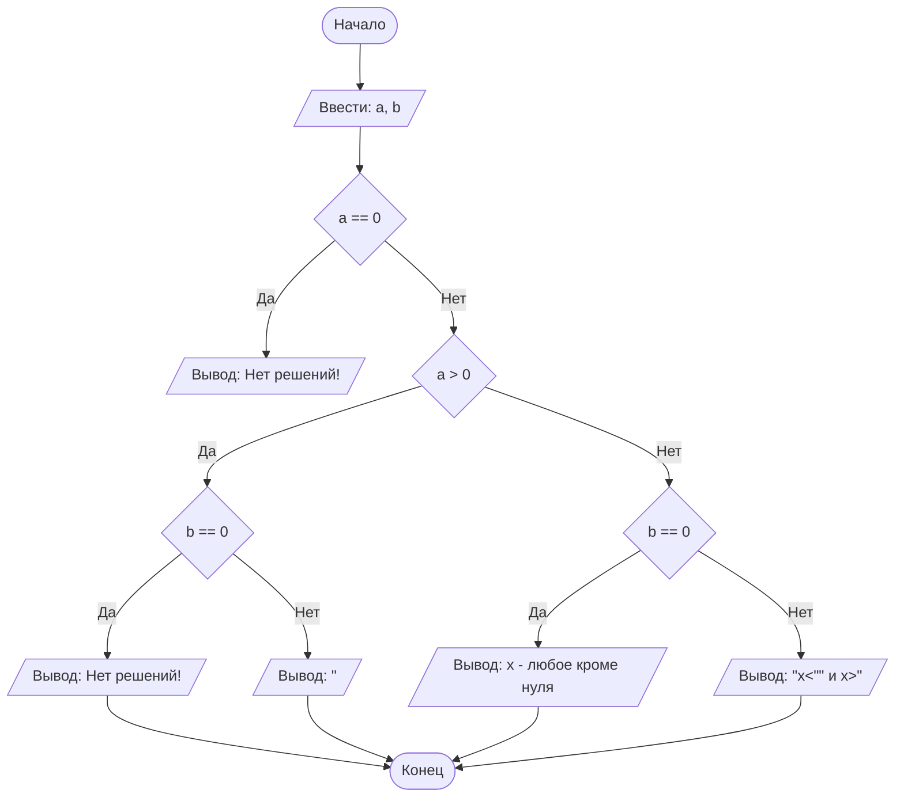

## Отчет по лабораторной работе № 1

#### № группы: `ПМ-2401`

#### Выполнил: `Плешаков Вадим Алексеевич`

#### Вариант: `21`

### Cодержание:

- [Постановка задачи](#1-постановка-задачи)
- [Входные и выходные данные](#2-входные-и-выходные-данные)
- [Выбор структуры данных](#3-выбор-структуры-данных)
- [Алгоритм](#4-алгоритм)
- [Программа](#5-программа)
- [Анализ правильности решения](#6-анализ-правильности-решения)

### 1. Постановка задачи

> Дано неравенство: a/(x*(x + b))< 0 ,где a и b — параметры (вводятся с клавиатуры). 
> Решите его для x.

Нужно решить неравенство, учитывая все возможные решения для разных а и b. 
Если а положительный и b не 0,тогда нужно, что бы знаменатель был отрицательным.
Если а отрицательный и b не 0,тогда нужно, что бы знаменатель был положительным.
Если b = 0, то знаменатель всегда положительный, и неравенство будет иметь решения
только при отрицательном а.


### 2. Входные и выходные данные

#### Данные на вход

На вход программа должна получать 2 вещественных числа

|             | Тип                | min значение          | max значение           |
|-------------|--------------------|-----------------------|------------------------|
| A (Число 1) | Вещественное число | 4.9*10<sup>-324</sup> | 1.8*10<sup>308</sup>-1 |
| B (Число 2) | Вещественное число | 4.9*10<sup>-324</sup> | 1.8*10<sup>308</sup>-1 |
#### Данные на выход

Программа выводит ответ в виду одной из сторок:  
«Нет решений!»,  
«x - любое кроме нуля»,  
или строки с указанием диапазона удовлетворяющих условию значений х.

|          | Тип    |
|----------|--------|
| Строка 1 | Строка |

### 3. Выбор структуры данных

Поскольку хранить необходимо вещественные числа, выбран тип double.

|            | название переменной | Тип (в Java) | 
|------------|---------------------|--------------|
| Параметр а | `a`                 | `double`     |
| Параметр b | `b`                 | `double`     |


### 4. Алгоритм

#### Алгоритм выполнения программы:

1. **Ввод данных:**  
   Программа считывает два вещественных числа
   и записывает в соответствующие переменные (`a`, `b`) их значения.

2. **Проверка параметра а на нуль:**  
   Программа проверяет, равно ли значение `a` нулю.
   Если равно (значит выражение всегда равно нулю) выводит "Нет решений!".

3. **Сравнение параметра а с нулём:**  
    Если a больше нуля, то проверяем b, знаменатель должен быть отрицательным.
    Если a меньше нуля, то проверяем b, знаменатель должен быть положительным.

4. **Сравнение параметра b с нулём:**  
   Если параметр b=0, то при положительных а выводит "Нет решений!", при отрицательных а "х - любое кроме нуля"
   Если параметр b!=0, то выводит решение в виде промежутка и связки "и" (при её необходимости). 


#### Блок-схема



### 5. Программа

```java
import java.io.PrintStream;
import java.util.Scanner;
public class Main {
    // Объявляем объект класса Scanner для ввода данных
    public static Scanner in = new Scanner(System.in);
    // Объявляем объект класса PrintStream для вывода данных
    public static PrintStream out = System.out;
    public static void main(String[] args) {
        // ввод параметров
        double a = in.nextDouble();
        double b = in.nextDouble();
        // при а=0 неравенство всегда обращается в 0, то есть не имеет решений
        if (a==0){
            out.print("Нет решений!");
        } else {
            //при положительных а знаменатель должен быть отрицательным
            if (a>0) {
                if (b == 0) {
                    // при b=0 в знаменателе выражение x^2 - неотрицательное на R
                    out.println("Нет решений!");
                } else {
                    //если b ненулевое, то решение - промежуток между 0 и -b
                    out.println(Math.min(0, -b) + "<x<" + Math.max(0, -b));
                }
            } else {
                //при отрицательных а знаменатель должен быть положительным
                if (b==0){
                    // при нулевом b знаменатель положителен всегда кроме x=0
                    out.println("x - любое кроме нуля");
                } else {
                    //при ненулевом b решение - R без промежутка от 0 до -b
                    out.println("x<"+Math.min(0,-b)+" и x>"+Math.max(0,-b));
                }
            }
        }
    }
}
```

### 6. Анализ правильности решения

Программа работает корректно на всем множестве решений с учетом ограничений.

1. Тест для `A = 0, B = 0`:

    - **Input**:
        ```
        0 0
        ```

    - **Output**:
        ```
        Нет решений!
        ```

2. Тест для `A>0, B=0`:

    - **Input**:
        ```
        5 0 
        ```

    - **Output**:
        ```
        Нет решений!
        ```

3. Тест для `A > 0, B != 0`:

    - **Input**:
        ```
        10 -20
        ```

    - **Output**:
        ```
        0.0<x<20.0
        ```

4. Тест для `A < 0, B = 0`:

    - **Input**:
        ```
        -30 0
        ```

    - **Output**:
        ```
        x - любое кроме нуля
        ```

5. Тест для `A < 0, B != 0`:

    - **Input**:
        ```
        -10 3
        ```

    - **Output**:
        ```
        x<-3.0 и x>0.0
        ```
